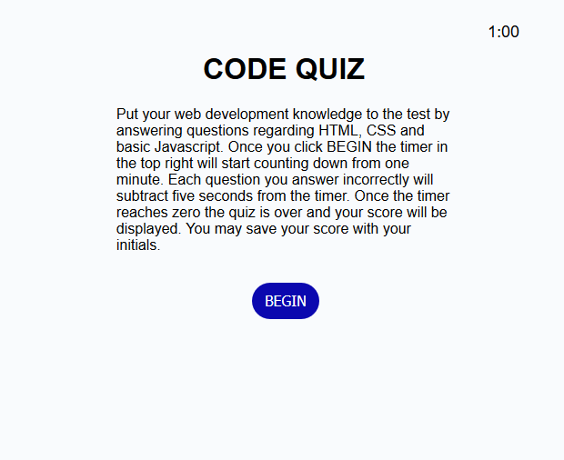
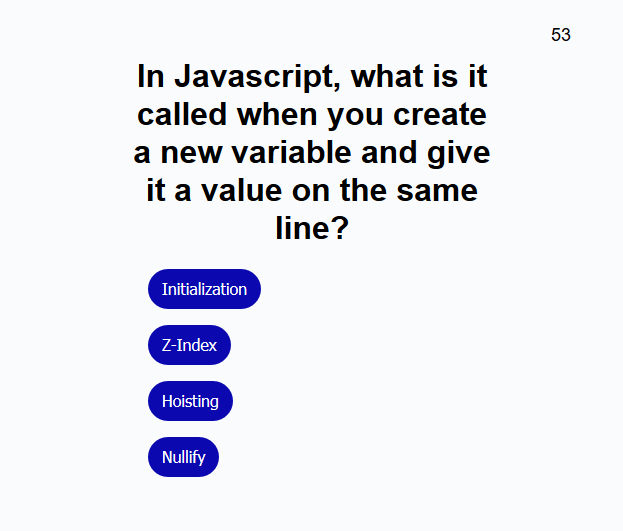
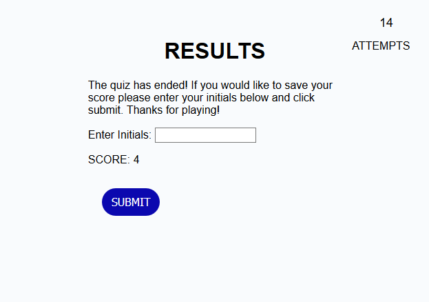

# code-quiz

This project is now live at https://ld-jenkins.github.io/code-quiz/ !

## Project Description

Have you ever wanted to test your basic HTML, CSS and Javascript skillz? Look no further.

My Code Quiz™ will test your ball of pink meat nestled within the cavity doctors would call a "skull" to see if you have what it takes to be the world's next Big Ol' Heckin' Genius of 2012™.

The only thing now between you and glory is clicking "BEGIN".

## The Rules

Once you've clicked begin you will immediately be prompted with a question and a countdown from one minute will commence. Any question answered correctly will give you one point while any question answered incorrectly will not give you one point and subtract five seconds from the timer.

Once the timer reaches zero or you have made it through all of the available questions, whichever happens first, you will be able to see the results of the knowledge you have gained over the years and finally show that it was totally worth that semester at community college.

If you enjoy keeping records of your brilliance you can even save your score along with your initials so you can show all of your friends and extended family at the next community potluck.

